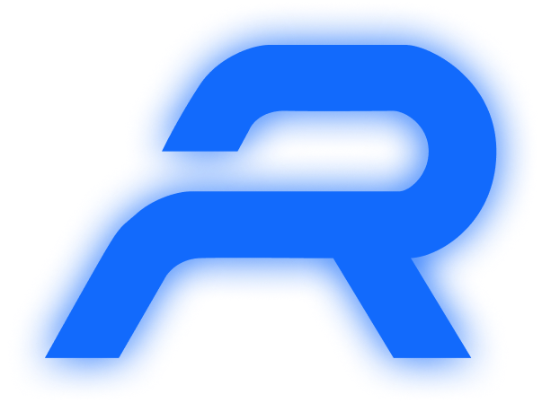

    
    <h2 align="center">Alt Reality</h2>
    <h5 align = "center"> Aren't you bored of the traditional ways of interacting with people online 🥱, clicking on a zoom/meet link just to attend and be bored to death? Us too. Do you miss the night meetings we had in college? Us too. Do you hate the chaos in a meeting full of people? Us too. Hence we present to you the idea of ""Alt Reality"", an interactive platform that aims to simulates the real world quite closely!

### What is the idea?
In ""Alt Reality"" everyone is a character which has their video feed attached to the it. You can move around the virtual area and interact with others just how you would in real life. As the character moves closer to the desired set of people, it would be able to hear them louder, and the volume will get lower if they move away, just like real life 🔥. 
 
If you wanted to talk to someone one on one during a group video call you would have to either call that person or get them on a different video call,  but on the contrary with ""Alt Reality"" you both can simply walk away from the group and have a talk and then join back, doesn't that sound super exciting and unique? It sure does. 
 
Another cool thing that can be achieved with ""Alt Reality"" is making the virtual area much more exciting by having mini games such as virtual football, etc."

### Links to other repositories
<ul>
<li><h5><a href="https://github.com/TeamRekursion/Alt-Reality-backend">Backend Repository</a></h5>
<li><h5><a href="https://github.com/TeamRekursion/Alt-Reality-Frontend">Frontend Repository</a></h5>
<li><h5><a href="https://github.com/TeamRekursion/Alt-Reality-WebRTC">WebRTC</a></h5>
</ul>

### Designs Link
<ul>
<li> <h5><a href="https://www.figma.com/file/m21Hh1KDpmQ3qyTDhkXVLC/Alt-Reality?node-id=1%3A2">Figma Link</a>
</ul>

### Tech Stack Used:
 
 
 
 
 
 
 

## Team Members
- Rithik Jain
- Mayank Kumar
- Chanakya Vivek Kapoor
- Swayam S Sharma
- Nirmit Jatana

	Made with :heart: by Team Rekursion</a>

